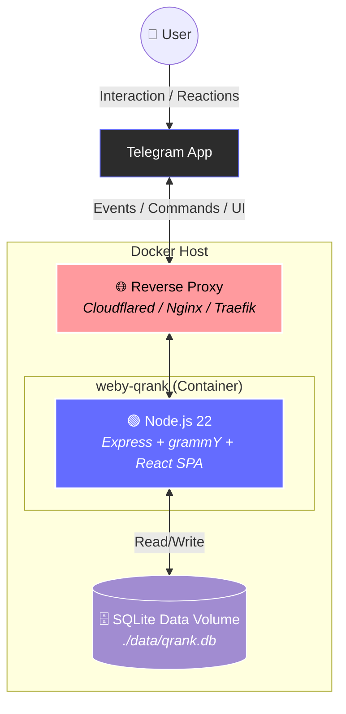

# Weby-QRank Community App 🏆 (Docker Edition)

<p align="center">
  <b>EN</b> | <a href="README.ua.md">UA</a>
</p>

<p align="center">
  
</p>
<p align="center">
  
</p>
<p align="center">
  
</p>

🚀 Meet Weby-QRank — the evolution of reputation engine for your Telegram community!

Tired of rating manipulations and meaningless flood?

Want to see real opinion leaders and support quality communication?

Weby-QRank is a modern Telegram Mini App that turns chat life into a transparent game protected from spam and manipulation.

⚡️ Why Weby-QRank is the new standard:

*   🎨 **Premium OLED Dark UI**: Elegant Bento Grid style design with blurred frosted glass (glassmorphism), mesh-gradients, and cascading loading animations.
*   ⚖️ **Smart Mathematical Scoring**:
    *   *Quality Index (Q)* — mass flood without feedback devalues reputation.
    *   *Anti-manipulation* — reaction weights between a pair of users decay over time, blocking collusions.
    *   *Reactor Reputation* — a like from a veteran user weighs more than from a newcomer.
    *   *Time Decay* — old messages lose weight (half-life: 30 days), keeping the rating dynamic.
*   📊 **Interactive Score Breakdown**: Click on any member's card to instantly see the full structure of their rating (number of messages, replies, and reactions across three categories: Guru, Flooder, and Skeptic).
*   🌐 **Localization UA | EN**: Convenient language switcher in the upper right corner with auto-save of the user's choice.
*   🐳 **Docker-first Architecture**: Easy launch and scaling of multiple bots in isolated containers using a single configuration file.

---

🔗 Make your chat a place of quality communication with Weby-QRank!

Open source code, quick start guide, and algorithm documentation are available in the repository: [Weby-QRank](https://github.com/Weby-Homelab/Weby-QRank)

    

---

## 🏗️ System Architecture (Docker)



---

## ⚖️ Scoring Algorithm & Formulas (QRank)

To ensure a fair leaderboard and prevent user collusion, Weby-QRank combines several progressive mathematical approaches:

### 1. Balance of Quality and Quantity (Quality Index)
Prevents boosting through mass messaging (flood / spam). A quality index $Q \in (0, 1]$ is calculated:

$$Q = \frac{M_{\text{engaged}} + 1}{M_{\text{total}} + 1}$$

- **$M_{\text{total}}$**: total number of user messages.
- **$M_{\text{engaged}}$**: number of messages that received at least one reaction or reply.
- *Example:* If a user sent 10 messages and 8 were reacted to, then $Q = 9/11 \approx 0.82$. If they sent 1000 messages and only 8 were reacted to, then $Q = 9/1001 \approx 0.009$, which nullifies their rating.

### 2. Collusion Prevention (Pairwise Discounting)
If two users (A and B) mutually boost each other, each subsequent reaction from A to B will have decaying weight on a harmonic scale:

$$W_{\text{pairwise}} = \frac{1}{k}$$

where $k$ is the sequence number of the reaction from user A to user B.
- **1st** reaction: weight $1.0$.
- **2nd** reaction: weight $0.5$.
- **100th** reaction: weight $0.01$.
The total influence of A on B is limited by the harmonic number $H_k \approx \ln(k) + \gamma$.

### 3. Reactor Reputation
A reaction from a user with high QRank weighs more than from a newcomer with zero rating:

$$W_{\text{reactor}} = \log_{10}(10 + K_{\text{weighted}})$$

- A user with QRank $0$ has a multiplier of $1.0$.
- A user with QRank $90$ has a multiplier of $2.0$.

### 4. Weight of Each Action
| Action | Base Weight | Description |
| :--- | :--- | :--- |
| **Sending message** | $+0.50$ | Encouraging communication (scaled by Q index). |
| **Receiving reply (Reply)** | $+1.00$ | Indicator that the message sparked a discussion. |
| **Reaction "Guru"** (🔥, 👍, 💯, 🤝, ❤️) | $+2.00$ | Useful or authoritative content. |
| **Reaction "Flooder"** (😁, 🤣, 🤪) | $+1.50$ | Humor, flood, emotions. |
| **Reaction "Skeptic"** (🤔, 👀, 🤷‍♂️, 🤯) | $+1.00$ | Analytics, doubts. |
| **Negative reaction** (👎, 🤮, 💩) | $-1.00$ | Spam, dislike. |

---

## 🚀 Quick Start (Docker Compose)

The easiest way to deploy the application:

1.  **Create a working directory:**
    ```bash
    mkdir weby-qrank-app && cd weby-qrank-app
    ```

2.  **Create a `docker-compose.yml` file:**
    ```yaml
    version: '3.8'
    services:
      qrank-bot:
        image: webyhomelab/weby-qrank:latest
        container_name: qrank-bot
        restart: unless-stopped
        ports:
          - "3015:3000"
        environment:
          - BOT_TOKEN=Your_Telegram_Bot_Token
          - DB_PATH=/app/backend/data/qrank.db
          - TRUST_PROXY=true
        volumes:
          - ./data:/app/backend/data
    ```

3.  **Run the container:**
    ```bash
    docker compose up -d
    ```
The application will be available on port 3015. All data is securely stored in the `./data/` directory.

---

## ⚙️ Admin Panel

Configuration is easily done via the built-in admin panel at `/admin`.


**Available settings:**
*   **Site Title:** (e.g. *🏆 KRUHLYK Community Leaderboard*)
*   **Telegram Bot Token:** `123456789:ABCdefGHIjklmNOPqrsTUVwxyz`
*   **Chat ID (optional):** `-100123456789`
*   **WebApp URL (for the Start button):** `https://qrank.weby.one/`
*   **Telegram ID of the chat owner:** (for prominent display at the top of the leaderboard)
*   **Change Admin Password:** (leave empty if not needed)
*   **Data Import:** Ability to upload a Telegram chat export in JSON format with full retrospective reputation calculation based on the new rules.

---

## 🤖 Telegram Bot Creation, Setup & Integration

For QRank to be calculated correctly, the bot must be properly created, configured, and added to the group:

### 1. Creating a bot via BotFather
1. Find the official **@BotFather** on Telegram and start a chat.
2. Send the `/newbot` command and follow the instructions.
3. Copy the generated **API Token**.

### 2. Disabling Privacy Mode (Group Privacy) — CRITICAL!
By default, bots only see commands starting with `/`. For the bot to register user messages, privacy mode **must be disabled**:
1. In the chat with **@BotFather**, send the `/setprivacy` command.
2. Select your bot from the menu.
3. Click the **Disable** button.

### 3. Adding the bot to the group
1. Go to your Telegram group settings.
2. Add your bot as a member.
3. Make the bot an **Administrator** of the group and grant it permissions to read/send messages.

---

## 🤝 Contributors
Any Pull Requests (PR) are highly welcome! Create an Issue if you find bugs or want to suggest new features.

## 📄 License
[MIT License](LICENSE)

<br>
<p align="center">
  Built in Ukraine under air raid sirens &amp; blackouts ⚡<br>
  &copy; 2026 Weby Homelab
</p>
