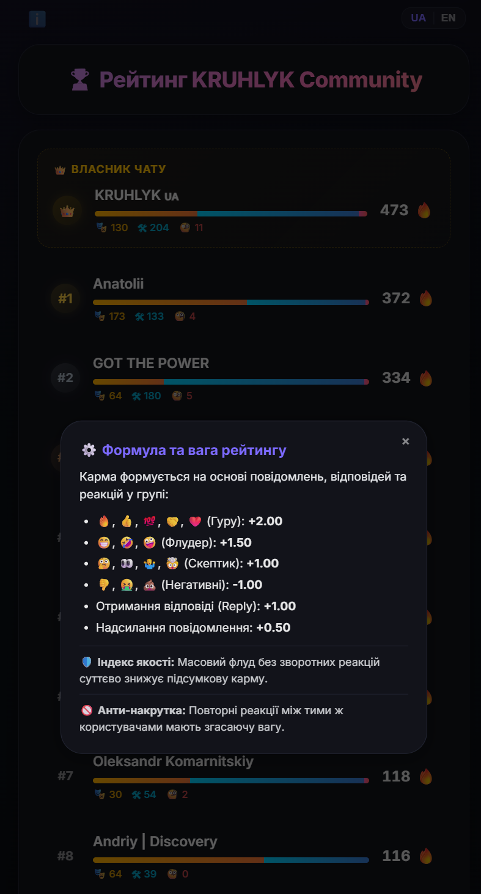
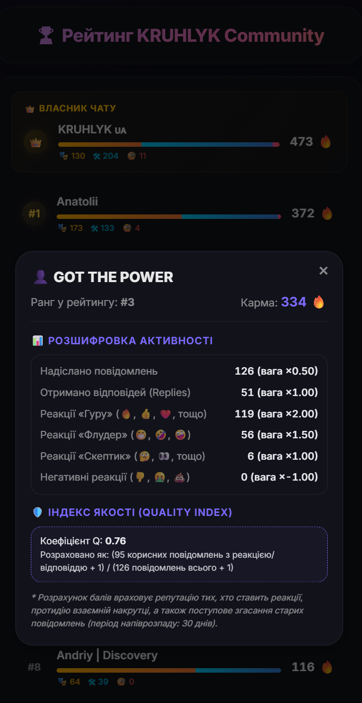
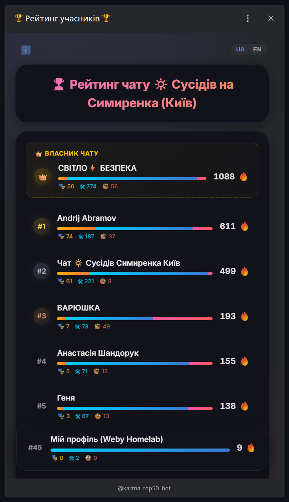
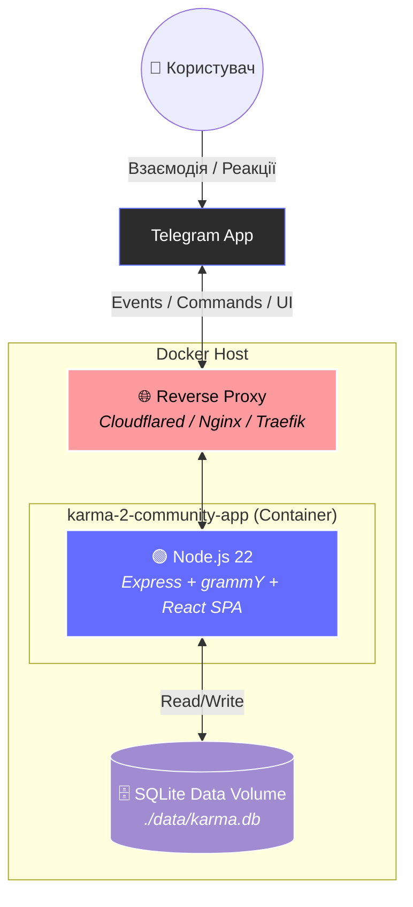

# Karma 2 Community App 🏆 (Docker Edition)

<p align="center">
  [English](README.md) | **Українська**
</p>

<p align="center">
  
</p>
<p align="center">
  
</p>
<p align="center">
  
</p>

Сучасний Telegram Mini App для гейміфікації спільноти. Ця версія (Karma 2) оптимізована для роботи в **Docker**-середовищі, підтримує легке горизонтальне масштабування (multi-tenancy), віддачу статичного React-застосунку та використовує **вдосконалену формулу розрахунку карми** для запобігання накруткам та спаму.

  

---

## 🏗️ Архітектура Системи (Docker)



---

## ⚖️ Алгоритм та Формули Карма-2 (Scoring Rules)

Для забезпечення справедливого рейтингу та запобігання змовам користувачів, Karma 2 поєднує декілька прогресивних математичних підходів:

### 1. Баланс якості та кількості (Quality Index)
Запобігає накруткам через масове надсилання повідомлень (флуд / спам). Розраховується індекс якості $Q \in (0, 1]$:

$$Q = \frac{M_{\text{engaged}} + 1}{M_{\text{total}} + 1}$$

- **$M_{\text{total}}$**: загальна кількість повідомлень користувача.
- **$M_{\text{engaged}}$**: кількість повідомлень, які отримали хоча б одну реакцію або відповідь (reply).
- *Приклад:* Якщо користувач надіслав 10 повідомлень і на 8 відреагували, то $Q = 9/11 \approx 0.82$. Якщо надіслав 1000 і відреагували на 8, то $Q = 9/1001 \approx 0.009$, що нівелює його рейтинг.

### 2. Запобігання змовам (Pairwise Discounting)
Якщо двоє користувачів (А і Б) домовилися взаємно "прокачувати" один одного, кожна наступна реакція від А до Б матиме меншу вагу за гармонійною шкалою:

$$W_{\text{pairwise}} = \frac{1}{k}$$

де $k$ — це порядковий номер реакції від користувача А до користувача Б.
- **1-ша** реакція: вага $1.0$.
- **2-га** реакція: вага $0.5$.
- **100-та** реакція: вага $0.01$.
Сумарний вплив А на Б обмежений гармонійним числом $H_k \approx \ln(k) + \gamma$.

### 3. Авторитет реактора (Reactor Reputation)
Реакція від користувача з високою кармою важить більше, ніж від новачка з нульовою кармою:

$$W_{\text{reactor}} = \log_{10}(10 + K_{\text{weighted}})$$

- Користувач з кармою $0$ має множник $1.0$.
- Користувач з кармою $90$ має множник $2.0$.

### 4. Вага кожної дії
| Дія | Базова Вага | Опис |
| :--- | :--- | :--- |
| **Надсилання повідомлення** | $+0.50$ | Заохочення до спілкування (масштабується індексом $Q$). |
| **Отримання відповіді (Reply)** | $+1.00$ | Показник того, що повідомлення викликало дискусію. |
| **Реакція "Guru"** (🔥, 👍, 💯, 🤝, ❤️) | $+2.00$ | Корисний чи авторитетний контент. |
| **Реакція "Flooder"** (😁, 🤣, 🤪) | $+1.50$ | Гумор, флуд, емоції. |
| **Реакція "Skeptic"** (🤔, 👀, 🤷‍♂️, 🤯) | $+1.00$ | Оцінка, сумніви. |
| **Негативна реакція** (👎, 🤮, 💩) | $-1.00$ | Спам, дизлайк. |

---

## 🚀 Швидкий старт (Docker Compose)

Найпростіший спосіб розгорнути додаток:

1.  **Створіть робочу директорію:**
    ```bash
    mkdir karma-2-app && cd karma-2-app
    ```

2.  **Створіть `docker-compose.yml`:**
    ```yaml
    version: '3.8'
    services:
      karma-bot:
        image: webyhomelab/karma-2-community-app:latest
        container_name: karma-bot
        restart: unless-stopped
        ports:
          - "3015:3000"
        environment:
          - BOT_TOKEN=Ваш_Telegram_Бот_Токен
          - DB_PATH=/app/backend/data/karma.db
          - TRUST_PROXY=true
        volumes:
          - ./data:/app/backend/data
    ```

3.  **Запустіть:**
    ```bash
    docker compose up -d
    ```
Додаток буде доступний на порту 3015. Всі дані надійно зберігаються у папці `./data/`.

---

## ⚙️ Адмін-панель
Налаштування додатка зручно здійснюється через вбудовану адмін-панель за адресою `/admin`.


**Доступні налаштування:**
*   **Заголовок сайту:** (напр. *🏆 Рейтинг KRUHLYK Community*)
*   **Telegram Bot Token:** `123456789:ABCdefGHIjklmNOPqrsTUVwxyz`
*   **Chat ID (опціонально):** `-100123456789`
*   **WebApp URL (для кнопки Start):** `https://kruhlyk.srvrs.top/`
*   **Telegram ID власника чату:** (для відображення на почесному місці у топі рейтингу)
*   **Змінити пароль Адміна:** (залиште пустим, якщо не треба)
*   **Імпорт Даних:** Можливість завантажити бекап карми у JSON-форматі з повною ретроспективною калькуляцією карми за новими правилами.

---

## 🤖 Створення, налаштування та інтеграція Telegram-бота

Щоб карма за реакції та репліки нараховувалася коректно, бот повинен бути правильно створений, налаштований та доданий у групу:

### 1. Створення бота у BotFather
1. Знайдіть у Telegram офіційного бота **@BotFather** та почніть діалог.
2. Надішліть команду `/newbot` та слідуйте інструкціям.
3. Скопіюйте отриманий **API Token**.

### 2. Вимкнення режиму приватності (Group Privacy) — КРИТИЧНО!
За замовчуванням боти бачать лише команди, що починаються з `/`. Щоб бот міг реєструвати повідомлення учасників спільноти, режим приватності **має бути вимкнено**:
1. У чаті з **@BotFather** надішліть команду `/setprivacy`.
2. Оберіть вашого бота з меню.
3. Натисніть кнопку **Disable**.

### 3. Додавання бота в чат/групу
1. Перейдіть у налаштування вашої групи в Telegram.
2. Додайте вашого бота до списку учасників.
3. Обов'язково призначте бота **Адміністратором** групи та надайте йому права на читання/надсилання повідомлень.

---

## 🤝 Контриб'ютори
Будь-які Pull Requests (PR) дуже вітаються! Створюйте Issue, якщо знаходите баги або хочете додати новий функціонал. 

## 📄 Ліцензія
[MIT License](LICENSE)

<br>
<p align="center">
  Built in Ukraine under air raid sirens &amp; blackouts ⚡<br>
  &copy; 2026 Weby Homelab
</p>
